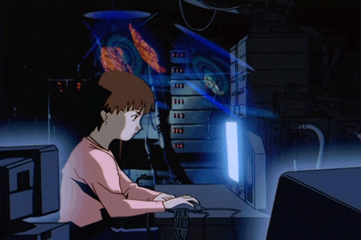

+++
title = "Don't invest in yourself"
date = "2024-05-12T09:03:20-03:00"
readingTime = true
+++

I was reading Finance Twitter and saw someone ask a well-known Twitter user the typical "what should I invest in" question, clarifying he was young, to which he replied it was better not to think about that and "invest in yourself" instead.

I'll explain why this idea is absurd from multiple perspectives.

I'm quite pessimistic about recommendations in general because they don't really exist as such. "Should I invest in this or that?", "what's safer, Android or iOS?", "are apps better than websites?", "should I use a VPN?" All these questions are impossible to answer by themselves; the answer is always IT DEPENDS. Each person is unique, and for each individual, the answer is different. Moreover, for the same person, the answer might change tomorrow. That's why in software engineering we don't learn answers, but rather the art of understanding requirements and reaching possible solutions.

I'll start questioning the idea of "investing in yourself" with a very basic concept: the amount of free knowledge on the internet is literally infinite. What's stopping you from using it? Knowing how to find and leverage it, and the fact that you only have one brain and 24 hours in a day. How much money can you really invest in yourself? Very little.

Let's take this to the absurd: if I give a 15-year-old one million dollars, how do they invest it in themselves? Do they look for the most expensive universities in the world and enroll in several degrees simultaneously? What would be the point of that? There's always a point where what you're paying for is no longer education, nor do you have the capacity to retain so much. Besides, the benefit of meeting people isn't for everyone; maybe it is for you, but not for many others. I mean, it's all nice, but don't let them take you for a fool either.

In several countries, there's a problem with many people who "invested in themselves" too much and the return on investment wasn't what they expected, and now they're in debt. I believe in studying what you want and what interests you, but you should always know that nothing guarantees it will "serve" for something, nor should anyone guarantee such a thing. The most important thing for making money isn't learning a million things, but having the consistency to pursue one and iterate.

The most valuable thing a person has is their time; what you need to "invest in yourself" is, above all, time, not money.

Keeping a young person away from investing is criminal, because their time advantage is fabulous. It's so true that ideally, BABIES should invest.

For example, if when someone is born you donate 100 dollars every month, putting everything in stocks and Bitcoin, when they turn 18, thanks to compound interest, they'll have their own house. Imagine the advantage of a kid who for the rest of their life will only have the fixed expenses of feeding themselves and paying for internet.

The best thing a young person without capital can do is hit the wall, but consciously. Throwing money at problems without thinking isn't the best idea. Just as recommending "playing it safe" is a bad idea, so is crashing it just because.

The values of saving and investment are useful even without having anything. If you don't think about it before having something, when you have it you won't know how to manage it (Research how most lottery winners end up, or countries that have infinite money on the ground and crash it). If you know nothing about investment and have no experience, it's even questionable whether working will do you any good. That's how you see people who worked for 45 years, retire and feel they got screwed.

At 13, I became very interested in economics and understanding why we had inflation. I was surprised to see that the problem was quite stupid. Looking for something that had stable emission and demand, I learned about gold and from that moment started buying gold, but then realized it was stupid for me to invest in that if I was only 13 and earning 50 dollars a month. I had no capital to protect. That's when I realized that the best thing was to bet everything on something risky, and put everything into Bitcoin. From that moment, every penny I earned I used to buy more Bitcoin, and it didn't matter if it went to 0, I just understood my advantage: I'm 13, nothing happens.

During that time, I also got into gambling and online betting, and won and lost a lot of money. That's when I understood the wonderful thing that had happened to me: I had the feeling of a 50-year-old man who bet his house at the casino, but 40 years earlier and without shooting myself, which gave me a different ability to understand risks compared to my friends, invaluable knowledge, obtained much earlier and at an infinitely lower price.

Don't ask someone who's already won what to do, your advantages are different. Experimenting has the highest return in life, and now is when it's cheapest for you.

Buy low, sell high.

People learn things by experiencing them firsthand. In societies where capital accumulation isn't protected, capital doesn't exist, not because people lose it, but because they don't even try to accumulate it. If you don't understand how the market works, you won't be able to visualize your path toward what you want to achieve and won't even know what you want.

This applies to everything, for example with the body it's the same, it's not about which routine is better, it's literally understanding the principle of progressive overload and being able to visualize the projection over time in your mind. If not, you won't understand why the hell you're doing what you're doing.

